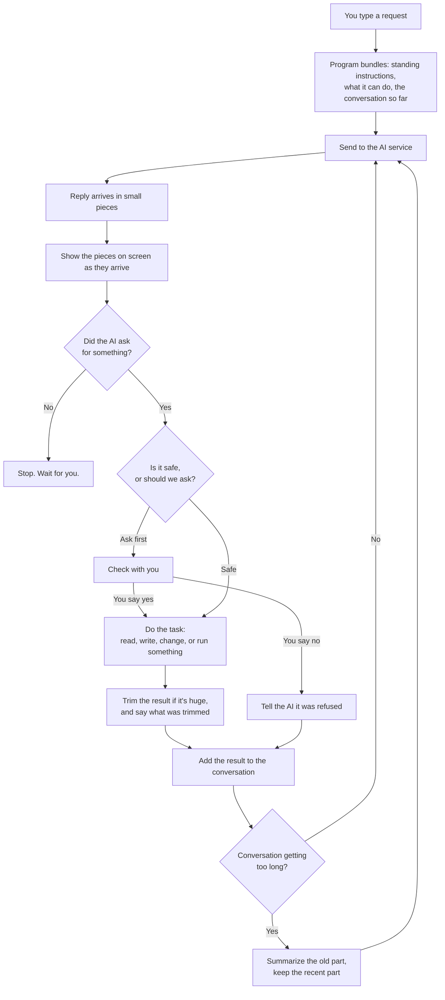

# How a Coding Agent Works — Plain Language

No jargon. If you've never written code, you should still be able to follow this.

---

## The one-sentence version

**A coding agent is a program that asks an AI to help, does what the AI asks for, tells the AI
what happened, and repeats until the AI says it's finished.**

That loop is the whole idea. Everything else is making the loop safe, fast, and pleasant to
watch.

---

## The useful analogy

Imagine hiring a brilliant programmer who works remotely, and who has three unusual limitations:

1. **They can't see your computer.** They can't open files or run anything themselves.
2. **They can't remember anything between messages.** Every message you send, you must re-send
   the entire conversation so far, or they've forgotten it.
3. **They can only reply with text.** They can't press buttons.

But they *can* write down requests. So you agree on a system: when they want something done,
they write it in a specific format — "read the file called `README.md`" — and **you** go do it and
report back.

The coding agent is the assistant who sits between you and this remote programmer. It carries
messages, does the tasks the programmer asks for, and reports the results back.

That's it. The "AI agent" is mostly a very disciplined messenger.

---

## Walking through one real request

You type:

> *fix the typo in README.md*

Here's everything that happens, in order.

**1. The program gathers the situation.** It doesn't just send your sentence. It bundles three
things: standing instructions ("you are a coding assistant, be concise, here's the project"), a
list of what it's able to do on the AI's behalf, and the conversation so far — including your new
sentence.

**2. It sends the bundle away** to the AI service over the internet.

**3. The reply arrives in pieces**, a few characters at a time, not all at once. This is why you
see text appear gradually rather than in one lump. The program shows each piece as it arrives.

**4. The reply contains a request.** Instead of an answer, the AI has written something like:
*"I'd like to read the file README.md."* It cannot read the file itself, so it's asking.

**5. The program notices the request and pauses.** It now has a decision: *should I do this?* For
reading a file, probably yes without asking you. For deleting files, it should stop and ask you
first.

**6. The program does the task.** It opens `README.md` and reads it.

**7. It trims the result if needed.** If the file were enormous, sending all of it would be
wasteful and might not even fit. So it sends part of it, plus a note: *"this is lines 1 to 2000
of 40,000 — the rest is saved over here if you want it."*

**8. It sends everything back** — the whole conversation *plus* the file contents — and asks the
AI to continue. Remember limitation #2: everything must be re-sent.

**9. The AI now asks for a change.** *"In README.md, replace `teh` with `the`."* Note that it
describes the change by quoting the exact text to find, not by line number. Line numbers go stale;
exact text either matches or it doesn't.

**10. The program checks with you.** This changes a file, so it asks: *allow this?* You say yes.

**11. It makes the change** and reports back that it worked.

**12. The AI replies with no request at all** — just *"Fixed the typo."*

**13. That's the stop signal.** No request means nothing left to do. The program stops looping
and waits for you.

Steps 4 through 11 are one **round trip**, and one instruction from you may take many of them. A
bigger task — "add tests for the login page" — might do thirty.

---

## The diagram

The loop from `C` back to `C` is the agent. Everything else is support.

---

## The five things that actually make it hard

None of these are about intelligence. They're all about plumbing.

**The conversation gets too long.** Because everything is re-sent every time, a long session
eventually exceeds what the AI can accept. The fix: when it gets close to full, ask the AI to
summarize the older part, then keep the summary and throw away the details. Like taking meeting
notes and discarding the recording. You lose some fidelity, deliberately, to keep going.

**Things produce too much output.** Installing software can print forty thousand lines. Sending
all of it would fill the entire conversation with noise. So output gets trimmed — and crucially,
the program *tells the AI what it trimmed and where to find the rest*. Trimming isn't losing
information if you leave a forwarding address.

**Re-sending is expensive.** You pay per word sent, and you're sending the same standing
instructions and tool list every single round trip. Thirty round trips means thirty payments for
identical text. AI services offer a discount for repeated text — but only if it's *byte-for-byte
identical* and at the *start* of what you send. That constraint quietly shapes a lot of the
design: put nothing that changes at the beginning.

**It can break things.** The program runs real commands on your real computer. A misunderstanding
becomes a deleted folder. This is why it asks permission, why it refuses to touch files outside
your project, and why the best safety measure is making mistakes easy to undo — save your work
before letting it start, and a mistake costs a minute instead of a day.

**Interruptions are messy.** If you stop it halfway through a task, the conversation is left in an
invalid state: the AI asked for something and never got an answer. Send that back and the AI
service rejects it outright. So the program has to notice unanswered requests and fill them in
with "this was interrupted."

That last one sounds trivial and is the kind of thing that only shows up after you've shipped
something and had a session mysteriously stop working forever.

---

## What surprised me most

Three things worth knowing, because they cut against expectation.

**The AI is not in charge.** It cannot do anything. It writes requests; the program decides
whether to honour them. Every safety measure lives in the program, not in the AI's good
intentions.

**Very little of the code is about AI.** Most of it is trimming output, remembering
conversations, drawing text on a terminal, and asking "are you sure?" The part that talks to the
AI is a small fraction.

**Four abilities are enough.** Read a file, write a file, change part of a file, run a command.
That's a working coding agent. Everything beyond that — searching, planning, splitting work
across helpers — is a convenience layered on top of those four.

---

## Where to go next

- **`02-beginner.md`** — the same thing as actual code, about sixty lines, and then an honest
  list of everywhere it falls apart.
- **`03-production.md`** — how real ones are built, with the technical names for everything
  described above.
- **`../04-glossary.md`** — every term, in plain words, with an everyday comparison.
