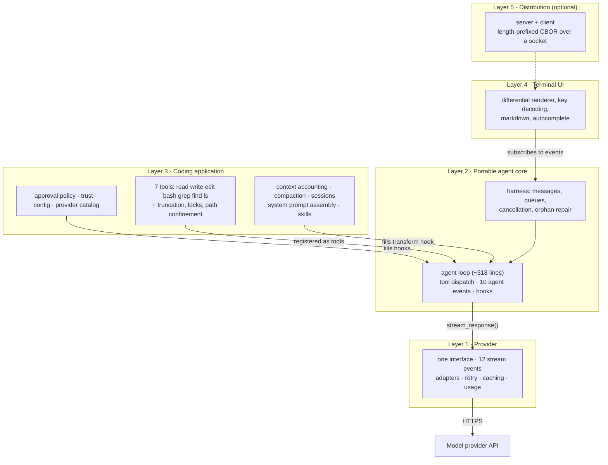

# The Production Architecture

Pi as the exemplar, Tau as the Python mirror. Every layer, every boundary, what crosses each
boundary, and one keypress traced all the way to rendered output.

Read `02-beginner.md` first if you haven't — this document is essentially the answer to its nine
failures.

---

## 1. The stack



**The rule that shapes everything:** dependencies point **downward and inward**. Layer 1 knows
nothing above it. Layer 2 knows nothing about coding, files, or terminals. Layer 3 supplies
*policy* into Layer 2's hooks. Layer 4 only *watches*.

That's why the loop stayed at ~318 lines while the system grew to 145,000.

| Layer | Pi | Tau |
|---|---|---|
| 1 Provider | `packages/ai` (21,429) | `tau_ai` (4,891) |
| 2 Agent core | `packages/agent` (10,148) | `tau_agent` (1,752) |
| 3 Coding app | `packages/coding-agent` (55,895) | `tau_coding` (29,771) |
| 4 Terminal UI | `packages/tui` (14,184) | `tau_coding/tui` (11,501) |
| 5 Distribution | `protocol`+`server`+`client` (5,875) | — none — |

---

## 2. The boundaries, and what crosses them

A boundary is only real if you can name the data that crosses it. Four boundaries, four shapes.

### Boundary A — Agent core → Provider

**Down (the request):**

```python
stream_response(
    model:    str,
    system:   str,
    messages: list[AgentMessage],   # user | assistant | toolResult
    tools:    list[AgentTool],
    signal:   CancellationToken | None,
) -> AsyncIterator[AssistantMessageEvent]
```

**Up (the response):** a stream of **12 events** — `start`; `text_start/delta/end`;
`thinking_start/delta/end`; `toolcall_start/delta/end`; `done`; `error`.

**Guarantees the provider layer owes upward:**
- exactly one `start`, exactly one terminal (`done` or `error`) — synthesized if the vendor fails
  to send one
- every streaming event carries `partial`: the whole message so far
- failures arrive as `error` events, never as thrown exceptions
- retries are invisible — swallowed below this line
- stop reasons normalized to `stop` / `length` / `toolUse`

→ `../01-teardown/01-provider-stream.md`

### Boundary B — Coding app → Agent core (the hooks)

This is the seam that matters most. Policy flows *down* as callbacks:

| Hook | Signature | Filled by |
|---|---|---|
| `before_tool_call` | `(ToolCall) -> (blocked, reason)` | approval, trust, protected paths |
| `after_tool_call` | `(ToolCall, result, is_error) -> (result, is_error)` | truncation, redaction |
| `transform_context` | `(messages) -> messages` | **compaction** |
| `convert_to_llm` | `(AgentMessage[]) -> Message[]` | dropping UI-only messages |
| `get_steering_messages` | `() -> messages` | typed-while-running input |
| `get_follow_up_messages` | `() -> messages` | queued next task |
| `should_stop_after_turn` | `(ctx) -> bool` | graceful stop |
| `prepare_next_turn` | `(ctx) -> {context?, model?}` | mid-run model switch |
| `get_api_key` | `(provider) -> str` | expiring OAuth |

Tau implements the first six; Pi all nine.

**The load-bearing fact:** an 880-line compaction subsystem attaches through *one* of these
(`transform_context`), and the loop contains no compaction code at all.

→ `../01-teardown/02-agent-loop-tools.md` §2.1, §4

### Boundary C — Tools → Agent core

**Down:** an `AgentTool` — `name`, `description`, `parameters` (JSON Schema), `execute`, plus
optional `prompt_snippet` / `prompt_guidelines` (folded into the system prompt) and `render_call` /
`render_result` (used by Layer 4).

**Up:** an `AgentToolResult` — `content` (goes to the model), `details` (goes to the UI only),
`added_tool_names`, `terminate`.

**The `content` / `details` split is the point.** A diff tool sends the model a compact summary
and hands the renderer a rich structured diff. Same call, two audiences, one budget protected.

→ `../01-teardown/02-agent-loop-tools.md` §2.3

### Boundary D — Agent core → UI

**Up only.** Ten events: `agent_start/end`, `turn_start/end`, `message_start/update/end`,
`tool_execution_start/update/end`.

Nested scopes: agent ▸ turn ▸ message ▸ tool execution. `message_update` carries *both* the
accumulated message and the raw Layer-1 event, so a coarse renderer redraws the message while a
fine one animates a single token.

**Nothing flows down.** The UI cannot call the loop; it queues messages on the harness. That's
what makes Layer 5 possible, and why Tau's whole agent→UI bridge is **99 lines**.

→ `../01-teardown/04-terminal-ui.md` §3

---

## 3. One keypress, traced end to end

You press Enter on *"fix the failing test in auth"*.

**Input**
1. Raw bytes arrive on stdin; the key decoder turns them into an Enter event.
2. The UI reads the input buffer and calls `harness.prompt(text)`.
3. The harness checks `_ensure_not_running`, then calls `_append_interrupted_tool_results()` —
   repairing any orphaned tool call left by a previous interrupt **before** anything is sent.
4. A `UserMessage` is appended and the loop generator is started.

**Assembly** (per request, not per user turn)
5. `AgentStartEvent`, `TurnStartEvent` emitted → UI shows a spinner.
6. `transform_context` runs. Context is estimated at `chars/4` across system prompt, messages,
   **and tool schemas**. Over `window − 16,384`? Compaction fires: summarize the old prefix
   (merging into any previous summary), keep ~20k recent tokens verbatim.
7. `convert_to_llm` / `_provider_context` filters out anything unsendable — notably empty
   failed turns, which providers reject.
8. The payload is ordered **`tools` → `system` → `messages`** and cache breakpoints are placed:
   last tool, final system block, this request's tail, the previous request's tail.

**Provider**
9. The adapter translates neutral messages into vendor JSON, resolves credentials via the auth
   callback, and opens an HTTPS stream.
10. Vendor chunks arrive. The adapter canonicalizes them: opening a text block emits
    `text_start`, each chunk `text_delta`, and a channel switch closes the open block first so
    every `*_start` has a matching `*_end`. Retries are swallowed here.
11. Layer 2 maps those onto `MessageStartEvent` / `MessageUpdateEvent` / `MessageEndEvent`.
12. The UI receives `message_update` ~10×/sec (throttled), diffs the frame, writes only changed
    cells.

**Tools**
13. The stream ends with `done` and the message contains two `toolCall` blocks.
14. `has_more_tools = bool(assistant.tool_calls)` → keep going. (Content, not `stop_reason`.)
15. For each call: `ToolExecutionStartEvent` **first** (so a blocked attempt is still visible),
    then `before_tool_call`. Blocked → an error tool result. Allowed → execute.
16. `bash` runs the test suite. Output streams through a 100 ms throttle as
    `ToolExecutionUpdateEvent`s. It exceeds 2,000 lines, so it's truncated tail-first, the full
    text is written to a temp file, and the notice states the line range and that path.
17. Exit code is non-zero, so the tool throws — with the captured output attached. The loop
    catches it (`CancelledError` re-raised first) and produces a tool result with
    `is_error=True`. **The model sees the failures, not just "exit 1".**
18. `after_tool_call` may rewrite the result. `ToolExecutionEndEvent`, then the
    `ToolResultMessage` is appended and emitted.

**Commit and repeat**
19. `TurnEndEvent(message, tool_results)`. Entries are appended to the session JSONL —
    one object per line, wire shape as stored shape, each carrying a `parent_id`.
20. Steering queue drained. Back to step 6 for the next request.
21. Eventually an assistant message arrives with **no** tool calls, the follow-up queue is empty →
    `AgentEndEvent`. The UI stops the spinner and shows tokens, cost, and cache hit rate.

**Round trips 6–20 repeat many times per user turn.** That's why cache breakpoints are recomputed
every request, not every turn.

---

## 4. Where each beginner failure got fixed

| Failure (`02-beginner.md`) | Fixed at | Mechanism |
|---|---|---|
| 1 context fills up | L3 → hook | `transform_context` + compaction |
| 2 huge output | L3 tools | truncate 2k lines/50 KB, spill to temp file |
| 3 Ctrl-C bricks it | L2 harness | cancellation token + orphan repair |
| 4 destructive commands | L3 → hook | `before_tool_call`, path confinement, `prepare` seam |
| 5 rate limits | L1 | retry with backoff, invisible upward |
| 6 no streaming | L1 → L2 → L4 | 12 events → 10 events → diffed frames |
| 7 provider lock-in | L1 | one interface, adapters per *wire format* |
| 8 concurrent edits | L3 tools | per-resolved-path lock |
| 9 cost | L1 + assembly | 4 cache breakpoints on a byte-stable prefix |

Every fix landed in a different layer. **None landed in the loop.**

---

## 5. Pi has it / Claude Code documents it / you decide

Grounded in Pi's source and in Claude Code's *public documentation and observable behaviour* only
— its CLI source is not public.

**In Pi's core:** provider abstraction, streaming events, the loop, tool dispatch, hooks,
compaction, sessions with branching, prompt caching, cost accounting, skills, TUI,
client/server, evals.

**In Pi as extensions, not core:** subagents, plan mode, todo, permission gates, sandbox,
protected paths, project trust, git checkpoints, `CLAUDE.md`-style rules, slash commands.

**Publicly documented in Claude Code and *not* in Pi at all:** MCP support, hooks that run
external shell commands on lifecycle events, and background/long-running task management. Pi
covers the analogous ground in-process via extensions.

**Yours to decide:** whether to build the extension API at all (Tier 3 at the earliest); Layer 5
(only if you want a second front-end); SQLite vs JSONL; how much of the provider quirk matrix to
carry; and whether to ship search tools or let `bash` cover it — Tau ships none.

---

## 6. Seven rules to carry into the build

1. **The event vocabulary is the architecture.** Two independent implementations converged on
   identical names. Copy them.
2. **Dependencies point inward.** The core defines interfaces; adapters and apps conform.
3. **The loop asks, never decides.** Every policy is a callback.
4. **Failures are data.** In-band errors all the way up, so partial work survives.
5. **Budget everything.** Output, context, summarizer input, frame rate — each has a cap and each
   says what it dropped.
6. **Three views of history.** The durable log ≠ the resolved path ≠ the provider payload.
   Conflating them is the bug.
7. **Stability is a feature.** Byte-stable prefixes make caching work; append-only history makes
   both caching and branching work.

---

*Next: `../04-folder-trees.md` for how this maps onto directories, and `../04-glossary.md` for
every term used here.*
