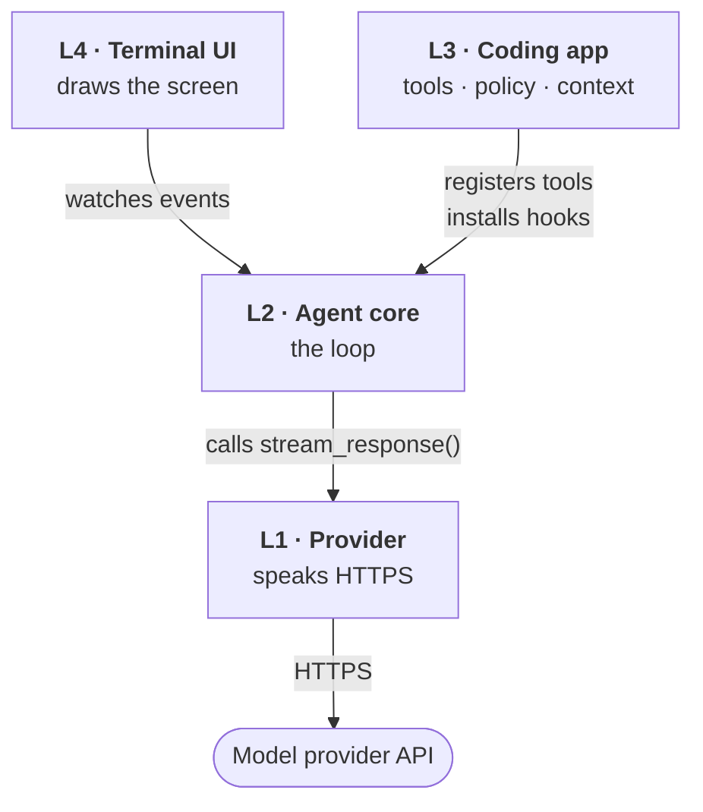

# Boundaries and Layout — the Simple Version

A companion to `03-production.md` §1–§2 and `04-folder-trees.md` §2, §5. Same content, fewer
assumptions. Read this if the stack diagram or the "up/down" wording didn't land.

---

## 1. The one rule that makes the diagram readable

The original diagram fails for a specific reason: **it draws three different relationships with the
same arrow.** "Calls", "registers with", and "watches" all look identical, so the picture reads as
soup.

Fix that first. From here on:

> **An arrow means: "this box knows the other box exists."**

Knowledge, not data. Data moves both ways along every arrow. Knowledge moves only one way — and
that one-way-ness *is* the architecture.

---

## 2. The stack



Four boxes, four arrows. That's the whole picture. (Layer 5 — running the agent on a server and
attaching from elsewhere — is optional and Tier 3+. Ignore it for now.)

Read every arrow as **"knows about"**:

| Arrow | Means |
|---|---|
| L4 → L2 | the UI imports the agent core. **The core has never heard of the UI.** |
| L3 → L2 | the coding app imports the core and hands it tools + callbacks. **The core doesn't know what a file is.** |
| L2 → L1 | the loop imports the provider interface and calls it. **The provider has never heard of the loop.** |
| L1 → API | the adapter makes the HTTPS request. |

**Nothing points upward. Ever.** That's the entire rule, and every design decision downstream falls
out of it.

### Why "downward and inward" confused you

The doc says dependencies point "downward and inward" but never says which way is down. Here it is:

```
       L4  UI              ← "up" / outer
       L3  coding app
       L2  agent core
       L1  provider        ← "down" / inner
```

**Down = toward L1.** Lower number = deeper = knows less about the world.

L1 is the most ignorant layer, and that's a *feature*: it knows nothing about files, terminals or
coding, so swapping Anthropic for OpenAI cannot break anything above it.

### The payoff, in one number

The loop is **~318 lines** in a system of **145,000**. It never grew. Everything was added *around*
it, in the layers, because nothing above L2 is allowed to reach in and change it.

---

## 3. The four boundaries — same three questions every time

Forget "up" and "down". For each boundary ask: **who calls whom**, **what goes in**, **what comes
back**.

### Boundary A · L2 agent core → L1 provider

| | |
|---|---|
| **Who calls** | the loop calls the provider |
| **Goes in** | `model`, `system`, `messages`, `tools`, `cancel signal` |
| **Comes back** | a *stream* of **12 events**, not one response |

```python
stream_response(model, system, messages, tools, signal) -> AsyncIterator[Event]
```

The 12 events: `start` · `text_start/delta/end` · `thinking_start/delta/end` ·
`toolcall_start/delta/end` · `done` · `error`.

**What L1 promises L2** — these promises *are* the boundary:

- exactly one `start`, exactly one ending (`done` or `error`) — invented if the vendor forgets
- errors arrive as an `error` **event**, never as a raised exception
- retries happen *below* this line and are invisible above it
- vendor stop reasons are normalised to `stop` / `length` / `toolUse`

That third promise is failure **#5** solved. The fourth is failure **#7**.

### Boundary B · L3 coding app → L2 agent core (the hooks)

The one that feels backwards, so go slowly.

| | |
|---|---|
| **Who calls** | **both** — and that's the point |
| **Goes in** | L3 hands L2 a bundle of functions (callbacks), once, at startup |
| **Comes back** | nothing. L2 *calls those functions* later, at the right moments |

L3 says: *"here's a function named `before_tool_call`. Run it before every tool."* The loop then
calls it without knowing or caring what's inside.

That's why the loop never grew: the **880-line compaction subsystem** plugs in through exactly one
of these callbacks (`transform_context`), and **the loop contains zero lines of compaction code.**

The nine hooks (Tau implements the first six, Pi all nine):

| Hook | When the loop calls it | What L3 puts there |
|---|---|---|
| `before_tool_call` | before running a tool | approvals, blocked paths → **failure #4** |
| `after_tool_call` | after a tool returns | truncation, secret redaction → **#2** |
| `transform_context` | before every request | compaction → **#1** |
| `convert_to_llm` | before every request | drop UI-only messages |
| `get_steering_messages` | between turns | text you typed while it was working |
| `get_follow_up_messages` | between turns | the next queued task |
| `should_stop_after_turn` | end of turn | graceful stop |
| `prepare_next_turn` | start of turn | switch model mid-run |
| `get_api_key` | before a request | refresh expiring OAuth |

**The loop asks, never decides.** Every policy is somebody else's function.

### Boundary C · L3 tools → L2 agent core

| | |
|---|---|
| **Who calls** | L3 registers tools; L2 executes them |
| **Goes in** | a `Tool`: `name`, `description`, `parameters` (JSON Schema), `execute` |
| **Comes back** | a `ToolResult`: `content` **and** `details` |

**The `content` / `details` split is the whole idea.** Two audiences from one call:

- `content` → goes to the **model**. Keep it small; it costs tokens.
- `details` → goes to the **UI only**. Costs nothing.

A diff tool sends the model `"3 lines changed in auth.py"` and hands the renderer a full colourised
diff. Same call, one budget protected.

You already have a primitive version of this: your `run_tool` returns `(text, is_error)`. The text
is `content`; the flag is where `details` begins.

### Boundary D · L2 agent core → L4 UI

| | |
|---|---|
| **Who calls** | nobody calls the UI — it **subscribes** |
| **Goes in** | nothing |
| **Comes back** | a stream of **10 agent events** |

The 10: `agent_start/end` · `turn_start/end` · `message_start/update/end` ·
`tool_execution_start/update/end`.

They nest: **agent ▸ turn ▸ message ▸ tool execution.**

**Nothing flows downward here at all.** The UI cannot call the loop. When you type, the UI *queues*
a message on the harness, and the loop picks it up when it's ready.

That strictness is why Tau's entire agent→UI bridge is **99 lines**, and why you could later run the
agent on a server with the UI on your laptop without rewriting either side.

---

## 4. Two event vocabularies — why `events.py` is separate from `types.py`

This was folder-trees point 3, and it's confusing because *both* things are called "events".

| | **12 stream events** | **10 agent events** |
|---|---|---|
| Live in | Layer 1 | Layer 2 |
| About | one model response arriving | the whole run's progress |
| Granularity | fine — one token at a time | coarse — "a tool started" |
| Audience | Layer 2 | Layer 4 (the UI) |
| Example | `text_delta` | `turn_start` |

Proof from Tau — both files exist, side by side:

```
tau/src/tau_agent/
├── provider_events.py   107 lines  ← the 12
└── events.py             87 lines  ← the 10
```

**So the advice means:** at Tier 1 you only write the 12. Put them in `events.py`, *not* in
`types.py`. Later, when Layer 2 needs the 10, you add a second file next to it — and the two
vocabularies stay visibly distinct.

Dump the 12 into `types.py` now and the 10 arrive later with no obvious home, get mixed in, and you
lose the ability to tell at a glance which layer an event belongs to.

Small decision now; saves a confusing refactor later.

---

## 5. What `fake.py` is

Folder-trees point 2. A **fake provider** — it implements the same interface as `anthropic.py`, but
instead of making an HTTPS call it returns responses you scripted in advance.

```python
class FakeProvider:
    def __init__(self, scripted): self.scripted = list(scripted)
    def stream_response(self, **kw): return self.scripted.pop(0)   # no network
```

Swap it in and your tests get:

| | real adapter | `fake.py` |
|---|---|---|
| network | yes | **no** |
| API key | required | **none** |
| cost | real money | **zero** |
| speed | seconds | instant |
| same input → same output | no | **yes** |

**You have already seen this work.** The tests for your `agent.py` replaced `chat` with a scripted
stand-in and proved the loop terminates, honours content over `stop_reason`, respects `MAX_TURNS`,
and keeps history — all with a dead API key. That *was* `fake.py`, written inline.

Two reasons it ships **with** the first adapter, not later:

1. **Your whole suite runs offline.** Directly relevant right now: you can build and test the
   entirety of Tier 1 with zero credits.
2. **It proves the interface is small enough.** If a fake is hard to write, the interface is too
   big. It's a design check disguised as a test utility.

---

## 6. The four layout rules, explained

### Rule 1 — one directory per layer, named after the layer

Someone should infer the architecture from `ls`. Not decoration: if you can't name the directory a
file belongs in, you don't yet know which layer owns that concern — and that's the moment to stop
and decide, not later.

### Rule 2 — interfaces live with the consumer, implementations in a subdirectory

Called "the single most important rule" in the doc. It means:

```
src/agent/
├── provider.py          ← DEFINES the interface   (the consumer owns it)
└── providers/
    ├── anthropic.py     ← IMPLEMENTS it
    └── fake.py          ← IMPLEMENTS it
```

The loop needs *a* provider. So **the loop's package defines what a provider must look like**, and
adapters conform to that shape. Not the reverse.

Get it backwards — let `anthropic.py` define the shape and make the loop adapt — and Anthropic's
quirks leak into the loop. Adding OpenAI then means editing the loop. **That is failure #7,
recreated by a directory layout.**

*"Reversing it later is painful"* because by then every layer has been written against the wrong
shape.

At Tier 1 this is just two files in one package. At Tier 3 they become separate packages and the
rule starts doing real work.

### Rule 3 — split the TUI app file before it needs splitting

Tier 3 concern; note it and move on. Tau's `app.py` hit **6,808 lines** — the one place Tau is
harder to read than Pi. UI files grow faster than you expect.

### Rule 4 — the loop gets its own file and should not grow

Your tripwire. If `loop.py` is getting longer, **something in it belongs in a hook.**

Ask: *is this a decision, or is this the mechanism?* Decisions (may I run this? should I compact? is
this output too long?) belong to L3, reached through a callback. Only the mechanism — ask model, run
tools, repeat — stays in the loop.

Pi's loop: 792 lines inside ~109,000. Tau's: 318 inside ~36,000. Neither grew as the systems did.

---

## 7. What this means for your Tier 1

Build strictly **bottom-up: L1 → L2 → L3.** Each layer depends only on the one below, so it's
complete and testable before you start the next.

| Order | File | Why here |
|---|---|---|
| 1 | `types.py`, `events.py` | the 12 events. Vocabulary before behaviour. |
| 2 | `provider.py` | the interface — **the consumer defines it** (Rule 2) |
| 3 | `providers/fake.py` | **before** the real adapter. Proves the interface is small. |
| 4 | `providers/anthropic.py` | now read `../01-teardown/01-provider-stream.md` |
| 5 | `tools.py`, `builtin_tools.py` | with output truncation this time — failure #2 |
| 6 | `loop.py` | content-based stop, `MAX_TURNS`. Watch Rule 4. |
| 7 | `main.py` | `print()`. **No TUI** — it would hide whether the loop works. |

Step 3 before step 4 is the one people skip. Don't — it's what lets everything after it be tested
without credits.

**Three sentences to carry in:**

1. Arrows mean "knows about", and they only ever point down.
2. The loop asks, never decides — every policy is somebody else's function.
3. If the loop is growing, something in it belongs in a hook.
